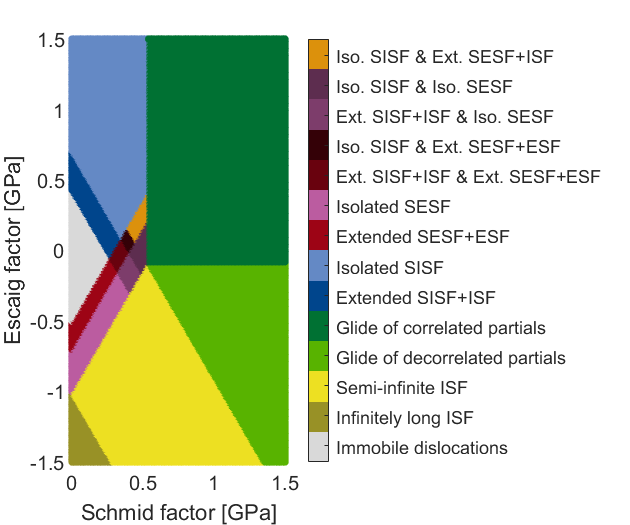
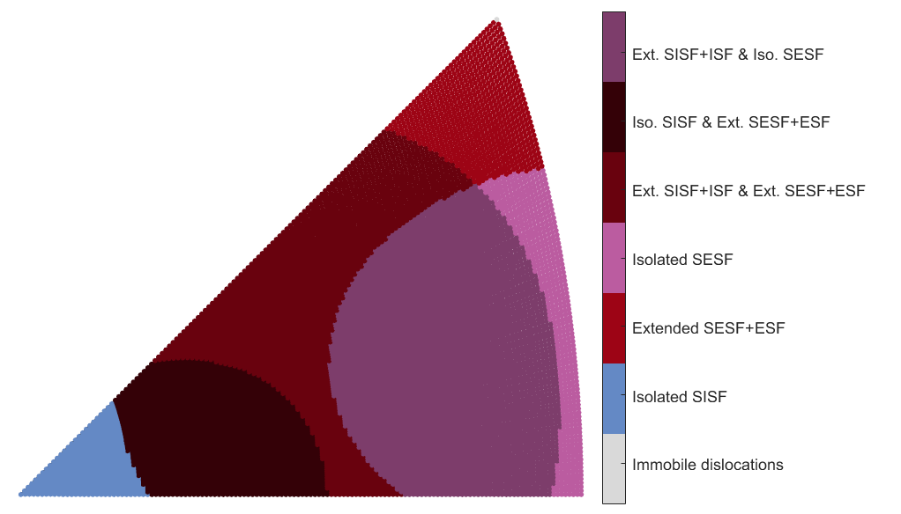
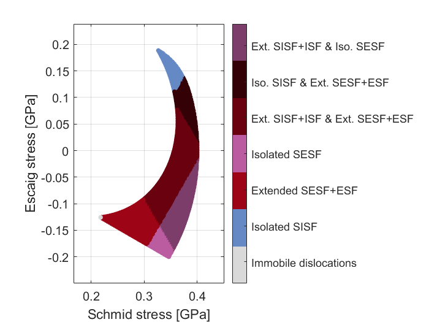

# Stacking-fault-maps
Maps of the stress orientation dependence for the appearance of different stacking fault (SF) and superlattice stacking fault (SSF) configurations in Ni-based superalloys strengthened by cuboidal precipitates. The precipitate bypassing mechanisms are calculated from 1D force balances. The fault configurations include:
* Infinitely long ISF
* Semi-Infinite ISF
* Extended SISF + ISF
* Isolated SISF
* Extended SESF + ESF
* Extended SESF + ISF
* Isolated SESF

The derivation and further details of this work have been published in: [F.D. León-Cázares, F. Monni, C.M.F. Rae. Acta Materialia, 199 (2020) 209-224](https://www.sciencedirect.com/science/article/abs/pii/S1359645420306297). Please cite this publication if you benefit from this repository.

## Requirements
Coded in Matlab R2021a. Plotting of the inverse pole figure (IPF) map requires the mtex toolbox (tested with version 5.1.0).

## License
This repository is published under a GNU GPL v3 license (). See `LICENSE.txt` for full licensing information.

## Contents
* **SF_maps.m** - Script to run all the functions and plot the maps.
* **sf_channel.m** - Calculation of the precipitate bypassing forces.
* **stacking_faults_region.m** - Calculation of the SF configurations that can develop for a given material and stress states.
* **m24.m** - Calculation of the Schmid and Escaig stresses. Additional details of this function can be found in this [repository](https://github.com/ferleoncazares/Stress-orientation-maps-fcc).

## How to use
Everything can be run from the **SF_maps.m** file. Input the required material parameters, uncomment the sections for the plots needed and select their individual input parameters. The sections are:

* Regions of stacking fault configurations - This section maps the SF and SSF that can develop within a range of Schmid and Escaig stresses determined by the user.

* Uniaxial loading inverse pole figure (IPF) - This section determines the SF and SSF configurations that can develop for all possible uniaxial loading directions, either for tension or compression. Make sure to add to path the mtex folder and initialise it with the command 'startup_mtex'. Decrease the parameter for the angular resolution and adjust the marker size to obtain more defined maps. The results are plotted in an IPF or on the IPF mapped onto the full stress map.

     
